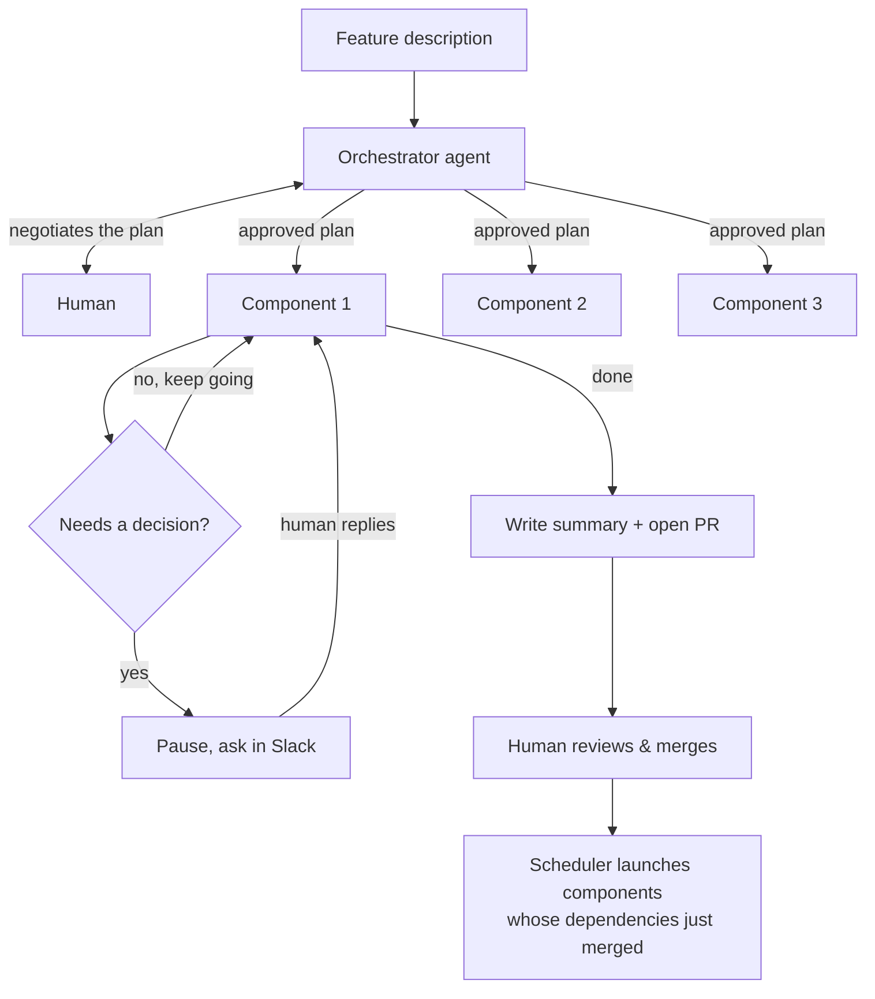

# Manifold

Manifold turns a plain-English feature description into a set of AI agents working in parallel, each on its own branch, that come back with pull requests instead of a wall of code you have to review from scratch. Your job shrinks to occasionally answering a question in Slack and deciding when to merge.

## The idea

You describe a feature or a branch of work. An orchestrator agent breaks it into components — independent, parallelizable chunks with their own file ownership and dependencies on each other. Each component gets its own git worktree, its own branch, and its own AI agent session working against it.

Those agents work autonomously. When one hits a decision that isn't really its call to make — a public interface, anything visual, a genuine judgment call — it pauses and asks you in Slack instead of guessing. Everything else, it just decides and keeps moving, leaving a trail of *why* behind.

When a component is done, its agent writes up what it did and opens a PR. You review and merge it like any other PR. Nothing merges itself.

## How it works

**The plan comes from a conversation, not a wizard.** You and the orchestrator go back and forth — it proposes a breakdown, you push back or ask for changes, it revises — until you're both happy. Only then does any actual work start.

**Agents pause, they never block.** This is the load-bearing idea in the whole system. When a component agent needs a human, it doesn't sit there waiting — a "waiting on a human" state is a database row plus a saved session ID, not a process holding a thread open. The agent's process exits. Days later, when you reply in the Slack thread, a fresh process picks the session back up with your answer as its next message. If Manifold itself crashes at exactly the wrong moment — mid-post to Slack, or right after you replied but before the resume fired — a reconciliation pass on startup notices the inconsistency and repairs it.

**Dependencies gate launches, not code.** A component only starts once every component it depends on has actually merged — no speculative work against an interface that might still change. This is intentionally simple for now: no partial starts, no guessing.

**Conflicts are surfaced, not resolved.** If a branch no longer merges cleanly against main, the agent pauses and shows you the conflicting hunks plus what's landed on main since it started — you decide, it doesn't guess. If two components touch the same files without having declared a dependency on each other, you get a warning (not a block) in case the original split was wrong.

## Architecture

| Piece | What it does |
|---|---|
| **Orchestrator** | Turns a feature description into a component breakdown, through a live back-and-forth with you. |
| **Scheduler** | Watches dependencies; launches a component's worktree + agent once everything it depends on has merged. |
| **Worktree manager** | Creates/removes the git worktree each component works in. |
| **Branch agent** | The actual AI agent working a component, with an `ask_human` tool for anything that needs your call. |
| **Slack resume listener** | Turns your reply in a thread back into a resumed agent session. |
| **Startup reconciliation** | Repairs the specific gaps a mid-flight crash can leave behind. |
| **Conflict handling** | Merge-conflict detection against main, plus cross-component file-overlap warnings. |
| **PR generation** | Writes the summary doc from the agent's decision log and opens the PR. |

Every one of these talks to the next through a plain interface (`Notifier`, `SessionResumer`, `GitHubClient`, and so on) rather than a concrete Slack/GitHub/SDK call — so the pieces can be built and proven independently, and the real integrations drop in without touching the logic around them.
